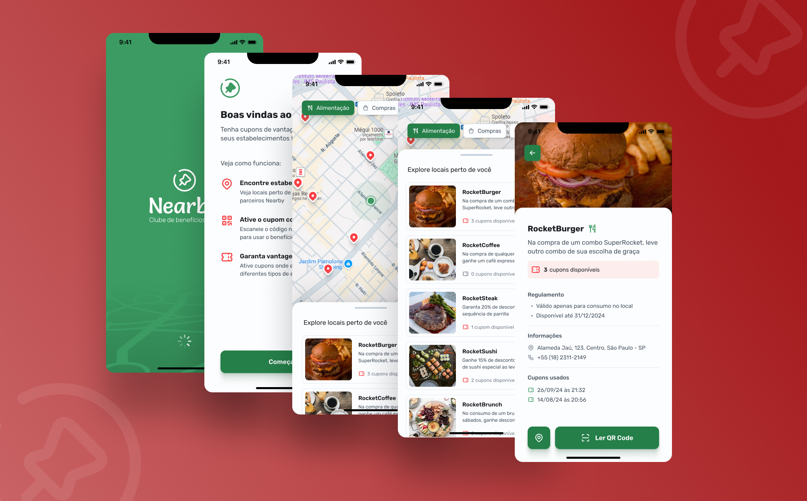

# Nearby App  

## 📱 Sobre o projeto  
Este é um aplicativo mobile desenvolvido com **React Native** que ajuda os usuários a localizar restaurantes próximos e acessar cupons de desconto exclusivos. Os usuários podem visualizar restaurantes diretamente em um mapa, verificar quantos cupons estão disponíveis e resgatá-los de forma prática usando um código QR.  

## 🚀 Funcionalidades  
- Exibição de restaurantes próximos em um mapa.  
- Verificação da quantidade de cupons disponíveis para cada restaurante.  
- Resgate de cupons por meio de QR Code.  

## 🛠️ Tecnologias utilizadas  
- **React Native**: Para o desenvolvimento do aplicativo mobile.  
- **Node.js**: Para o backend, garantindo uma comunicação eficiente entre o app e o servidor.  
- **Geolocalização**: Para exibir restaurantes próximos.  
- **QRCode**: Para validação e resgate de cupons.  
